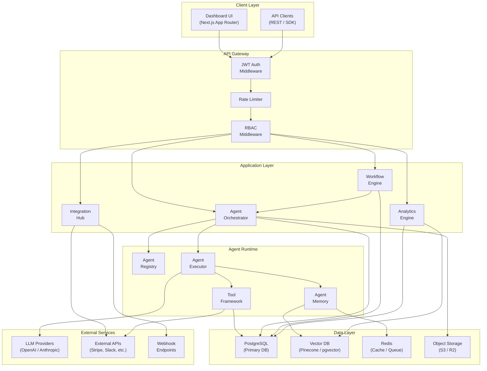
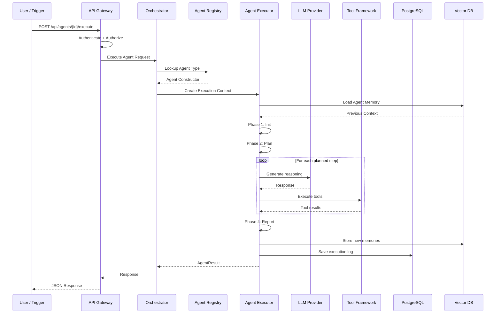
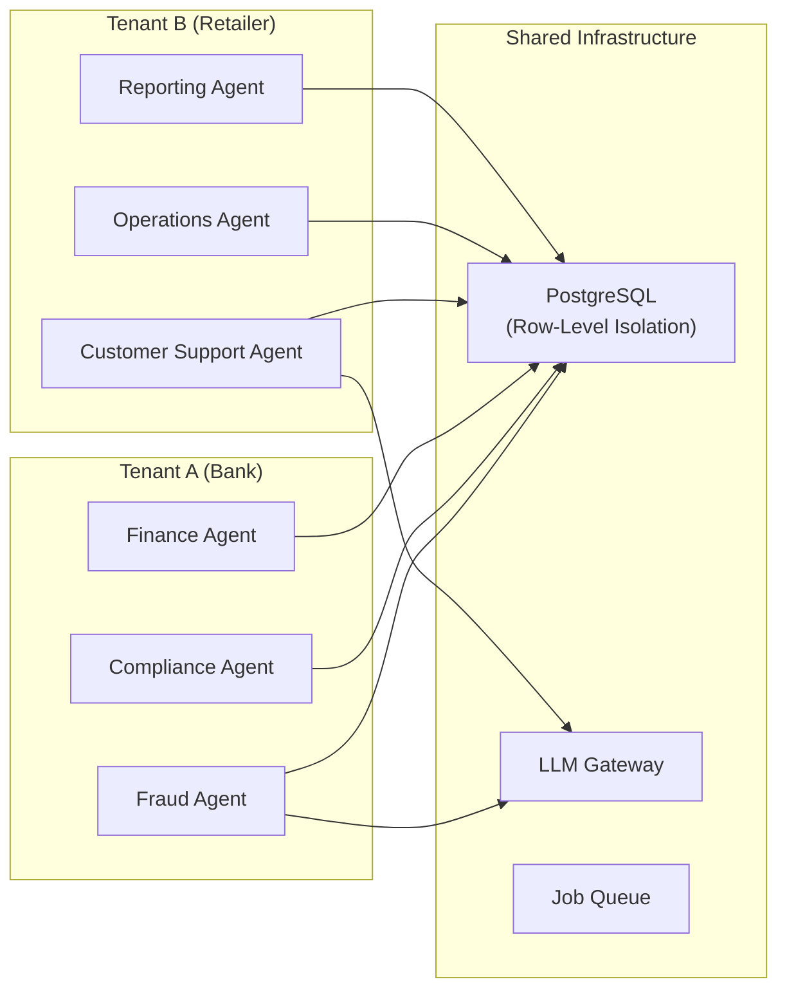
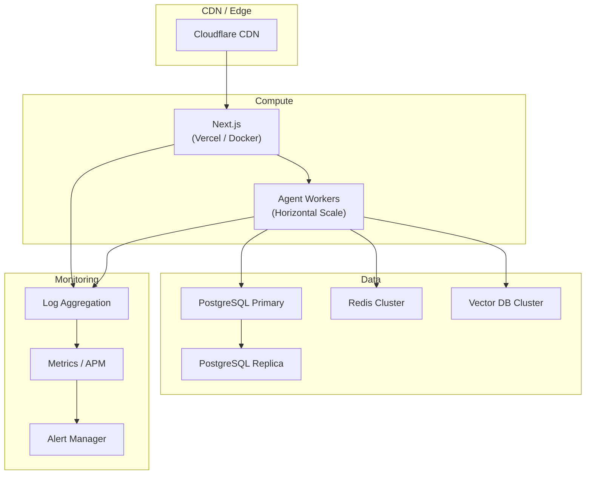

# Swifter AI Platform — System Architecture

## High-Level Architecture



## Component Overview

| Component | Technology | Purpose |
|---|---|---|
| Dashboard UI | Next.js 15 + TypeScript | Admin portal with agent management, analytics, workflows |
| API Layer | Next.js Route Handlers | RESTful API with JWT auth, RBAC, rate limiting |
| Agent Orchestrator | Custom TypeScript framework | Lifecycle management, scheduling, execution |
| Workflow Engine | Event-driven FSM | Multi-step workflow automation with branching |
| Integration Hub | Adapter pattern | Unified interface for external services |
| Primary Database | PostgreSQL + Prisma | Multi-tenant data storage with audit trail |
| Vector Database | Pinecone / pgvector | Agent memory, semantic search, RAG |
| Cache / Queue | Redis | Session cache, job queues, rate limiting |
| LLM Gateway | OpenAI / Anthropic API | Language model inference with failover |

## Data Flow — Agent Execution



## Multi-Tenant Architecture



## Deployment Topology



## Folder Structure

```
swifter-ai-platform/
├── prisma/
│   └── schema.prisma              # Database schema (11 models)
├── src/
│   ├── app/
│   │   ├── layout.tsx             # Root layout
│   │   ├── page.tsx               # Landing page
│   │   ├── globals.css            # Design system
│   │   ├── api/
│   │   │   ├── agents/route.ts    # Agent CRUD API
│   │   │   ├── workflows/route.ts # Workflow API
│   │   │   ├── analytics/route.ts # Analytics API
│   │   │   └── logs/route.ts      # Audit logs API
│   │   └── dashboard/
│   │       ├── layout.tsx         # Dashboard shell (sidebar + topbar)
│   │       ├── page.tsx           # Overview dashboard
│   │       ├── agents/page.tsx    # Agent management
│   │       ├── workflows/page.tsx # Workflow builder
│   │       ├── integrations/page.tsx
│   │       ├── logs/page.tsx      # Logs & audit trail
│   │       ├── analytics/page.tsx # AI insights
│   │       └── settings/page.tsx  # Settings & billing
│   ├── components/
│   │   └── icons.tsx              # SVG icon components
│   └── lib/
│       └── agents/
│           ├── base-agent.ts      # Abstract agent class
│           ├── agent-registry.ts  # Agent type registry
│           ├── agent-executor.ts  # Orchestration engine
│           └── types/
│               └── fraud-monitoring-agent.ts
└── docs/
    └── architecture.md            # This document
```
